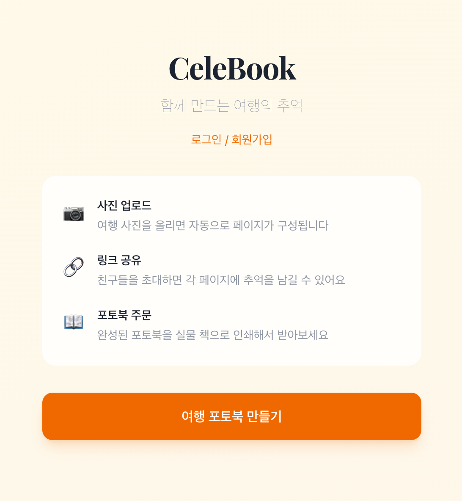
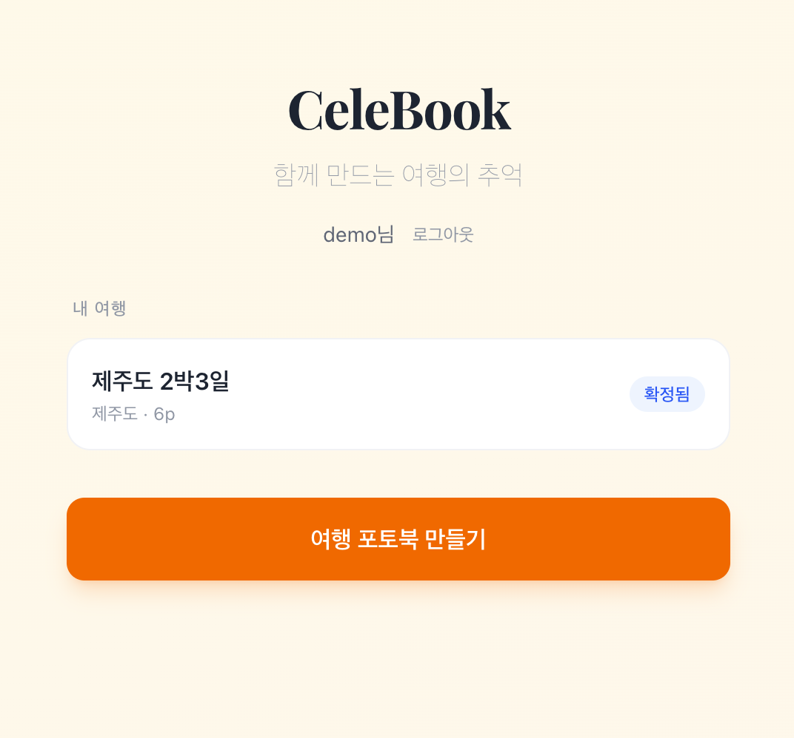
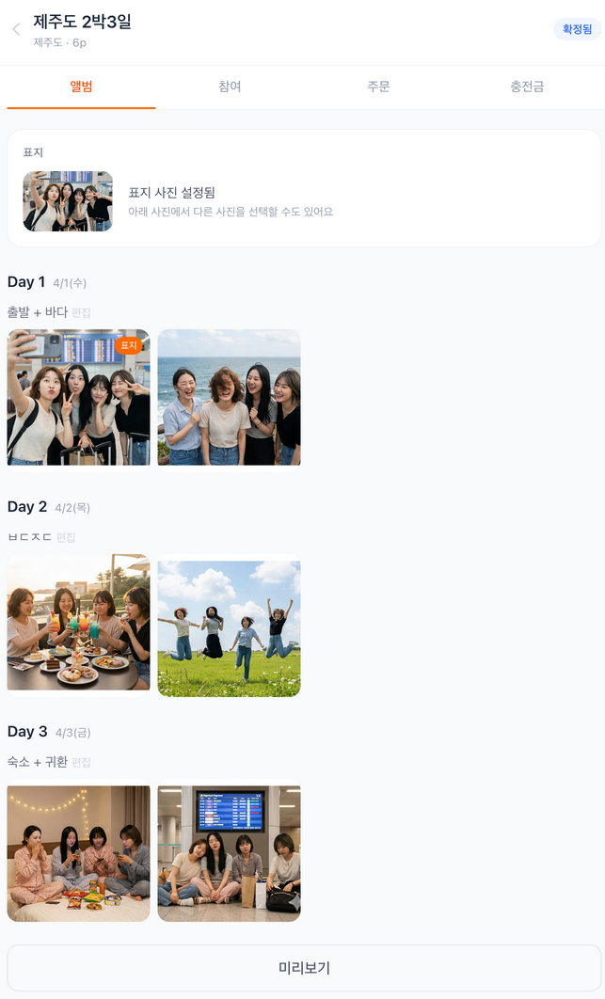
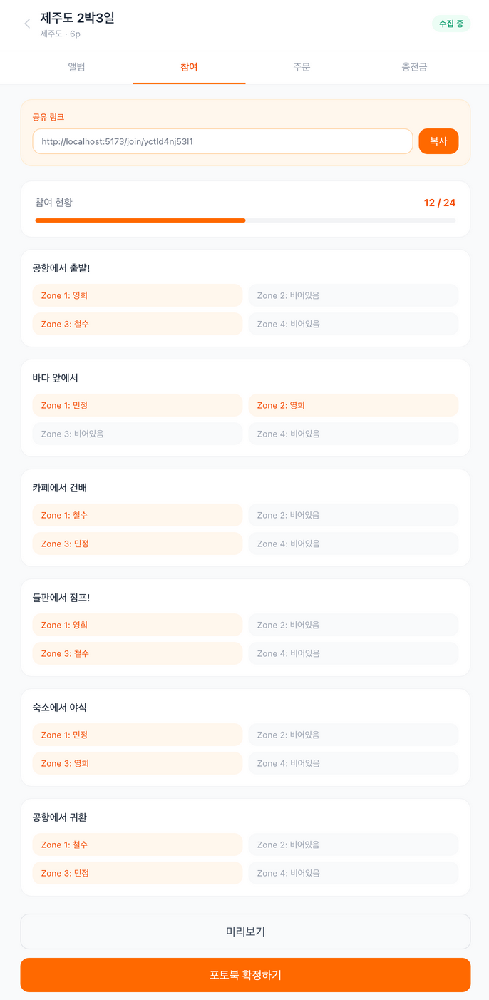
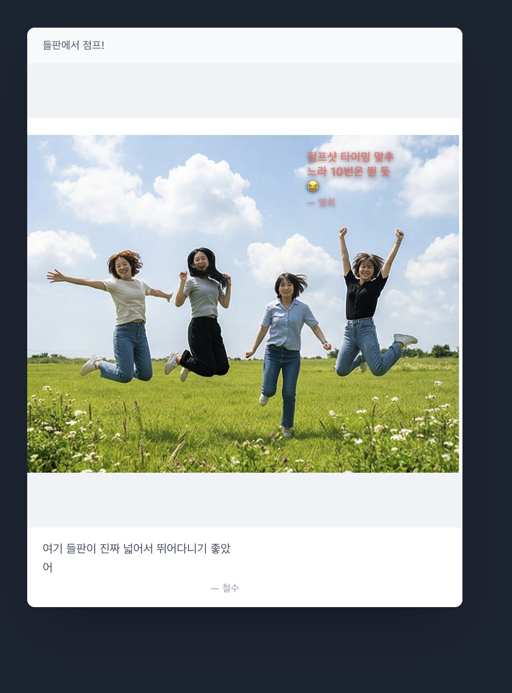
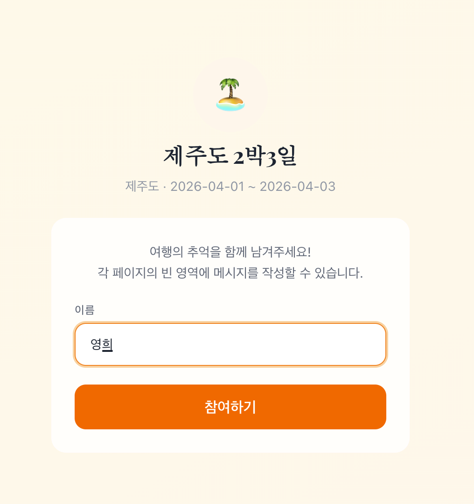
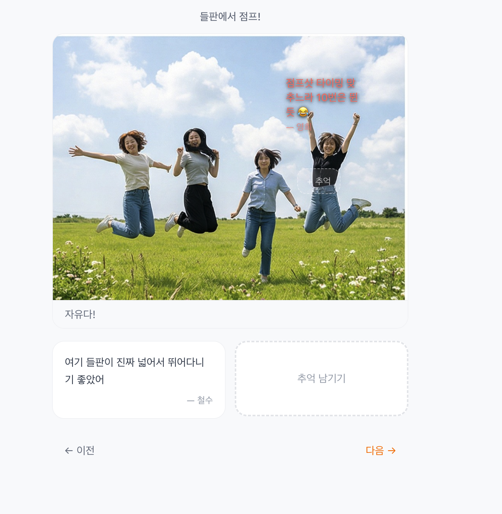

# CeleBook — 여행 포토북 협업 서비스

여행 다녀온 후, 함께 간 사람들이 같이 만드는 포토북 서비스입니다.

## 서비스 소개

**한 줄 설명:** 주최자가 여행 사진을 올리고, 참여자들이 각 페이지에 추억 메시지를 남겨 함께 포토북을 완성하는 협업 서비스

**타겟 고객:** 여행을 다녀온 20-30대 그룹 (주최자 1명 + 참여자 2-5명)

### 주요 기능

- **회원 시스템** — 간단한 가입/로그인, 내 여행 목록 관리
- **Day 기반 앨범 구성** — 출발일/도착일 입력 시 Day 자동 생성, 사진을 Day별로 분류
- **사진 일괄 업로드** — Day별 드래그 앤 드롭으로 사진 업로드, Day 간 사진 이동 가능
- **표지 사진 지정** — 업로드된 사진 중 하나를 표지로 선택
- **공유 링크로 협업** — 링크를 보내면 참여자가 각 페이지에 텍스트 추억을 남김 (비회원 가능)
- **사진 위 텍스트 배치** — 드래그로 위치 이동, 8가지 색상 프리셋 선택
- **미리보기** — 표지 → 목차 → Day 구분 페이지 → 사진 페이지 → 뒷표지 순서로 열람
- **포토북 인쇄 주문** — Book Print API 연동으로 실물 책 주문 (A4 소프트커버)
- **주문 관리** — 견적 조회, 주문 생성, 취소, 배송지 변경
- **충전금 관리** — 잔액 조회, Sandbox 테스트 충전, 거래 내역
- **Webhook 연동** — 주문 상태 변경 실시간 수신 + HMAC 서명 검증

### 화면 미리보기

| 랜딩 페이지 | 내 여행 목록 |
|:---:|:---:|
|  |  |

| 관리자 앨범 (Day별 사진 구성) | 참여 현황 |
|:---:|:---:|
|  |  |

| 미리보기 — 표지 | 미리보기 — 사진+메시지 |
|:---:|:---:|
|  |  |

| 참여자 진입 | 메시지 작성 |
|:---:|:---:|
|  |  |

---

## 실행 방법

### Docker (권장)

```bash
git clone https://github.com/sml1323/assignment_api_service.git
cd assignment_api_service

cp .env.example .env
# .env 파일에 BOOKPRINT_API_KEY 입력

docker compose up --build
```

브라우저에서 `http://localhost:8000` 접속. 더미 데이터 자동 생성됨.

### 로컬 실행

#### 요구사항

- Python 3.10+
- Node.js 18+
- Book Print API Sandbox Key ([api.sweetbook.com](https://api.sweetbook.com) 가입 후 발급)

### 설치 및 실행

```bash
# 저장소 클론
git clone https://github.com/sml1323/assignment_api_service.git
cd assignment_api_service

# 백엔드 설치
pip install -r backend/requirements.txt
pip install -e bookprintapi-python-sdk

# 프론트엔드 설치
cd frontend && npm install && cd ..

# 환경변수 설정
cp .env.example .env
# .env 파일에 BOOKPRINT_API_KEY 입력 (Sandbox Key)

# 프론트엔드 빌드
cd frontend && npm run build && cd ..

# 더미 데이터 생성 (데모 계정 + 제주도 2박3일 시나리오)
python -m backend.app.seed

# 서버 실행
uvicorn backend.app.main:app --host 0.0.0.0 --port 8000
```

브라우저에서 `http://localhost:8000` 접속

### 데모 계정

시드 실행 후 아래 계정으로 바로 로그인할 수 있습니다:

| 아이디 | 비밀번호 |
|-------|---------|
| demo | demo1234 |

> 로그인하면 "내 여행" 목록에 제주도 2박3일 더미 데이터가 표시됩니다.
> 시드 실행 시 콘솔에 주최자 대시보드 URL과 참여자 링크도 출력됩니다.

---

## 사용한 API 목록

### Book Print API

| API | 용도 |
|-----|------|
| `POST /books` | 새 포토북 생성 (PHOTOBOOK_A4_SC) |
| `POST /books/{bookUid}/photos` | 사진 업로드 (원본 + Pillow 합성 이미지) |
| `POST /books/{bookUid}/cover` | 표지 생성 (구글포토북C 테마) |
| `POST /books/{bookUid}/contents` | 내지 페이지 삽입 (photo, monthHeader, text) |
| `POST /books/{bookUid}/finalization` | 포토북 확정 (인쇄 준비 완료) |
| `POST /orders` | 주문 생성 (배송 정보 + 충전금 차감) |
| `POST /orders/estimate` | 가격 견적 조회 (VAT 포함) |
| `GET /orders/{orderUid}` | 주문 상태 확인 |
| `POST /orders/{orderUid}/cancel` | 주문 취소 (PAID/PDF_READY 상태) |
| `PATCH /orders/{orderUid}/shipping` | 배송지 변경 (발송 전) |
| `GET /credits` | 충전금 잔액 조회 |
| `GET /credits/transactions` | 충전금 거래 내역 |
| `POST /credits/sandbox/charge` | Sandbox 테스트 충전 |

### Webhook 이벤트

| 이벤트 | 처리 |
|-------|------|
| `order.status_changed` | 주문 상태 업데이트 + AuditLog 기록 |
| `order.shipped` | 배송 정보 업데이트 |

### 사용한 템플릿

| 템플릿 UID | 이름 | 용도 |
|-----------|------|------|
| `7CO28K1SttwL` | 표지 (구글포토북C) | 표지 — coverPhoto + subtitle + dateRange |
| `50f9kmXxelPG` | 내지_monthHeader | 섹션 구분 페이지 ("APRIL 2026") |
| `5ADDkCtrodEJ` | 내지_photo | 사진 페이지 — Pillow 합성 이미지 + dayLabel |
| `3mjKd8kcaVzT` | 내지b | 텍스트 페이지 — 참여자 하단 존 메시지 |
| `5NxuQPBMyuTm` | 빈내지 | 최소 24페이지 충족용 패딩 |

---

## API 연동 플로우

```
주최자 플로우                              Sweetbook API
─────────────                            ──────────────
                                         
 ┌──────────┐    ┌──────────┐    ┌──────────────┐
 │ 사진 업로드 │───→│ Pillow   │───→│ photos       │
 │ (일괄)    │    │ 텍스트합성 │    │ .upload      │
 └──────────┘    └──────────┘    └──────┬───────┘
                                        │
                                 ┌──────▼───────┐
                                 │ covers       │
                                 │ .create      │
                                 │ (구글포토북C)  │
                                 └──────┬───────┘
                                        │
                                 ┌──────▼───────┐
                                 │ contents     │  ← monthHeader
                                 │ .insert      │  ← 내지_photo (합성 이미지)
                                 │ (반복)       │  ← 내지b (텍스트)
                                 └──────┬───────┘
                                        │
                                 ┌──────▼───────┐
                                 │ finalize     │
                                 │ (책 확정)     │
                                 └──────┬───────┘
                                        │
                                 ┌──────▼───────┐    ┌──────────────┐
                                 │ estimate     │───→│ 가격 확인      │
                                 │ (견적)       │    │ + 잔액 확인    │
                                 └──────┬───────┘    └──────────────┘
                                        │
                                 ┌──────▼───────┐
                                 │ orders       │  → 자동 충전 (잔액 부족 시)
                                 │ .create      │  → 충전금 즉시 차감
                                 └──────┬───────┘
                                        │
  ┌──────────┐                   ┌──────▼───────┐
  │ DB 업데이트│←──── Webhook ←───│ 상태 변경 알림 │
  │ AuditLog │    (서명 검증)     │ (PAID→SHIPPED)│
  └──────────┘    (idempotency)  └──────────────┘
```

### 주문 상태 흐름

```
PAID(20) → PDF_READY(25) → CONFIRMED(30) → IN_PRODUCTION(40)
→ PRODUCTION_COMPLETE(50) → SHIPPED(60) → DELIVERED(70)

※ Sandbox 환경에서는 PAID 상태에서 멈춥니다 (실제 제작/배송 없음)
※ 파트너 취소: PAID/PDF_READY 상태에서만 가능 → CANCELLED_REFUND(81)
```

### Webhook 연동

- `POST /api/webhooks/sweetbook` — 주문 상태 변경을 실시간 수신
- HMAC-SHA256 서명 검증 (X-Webhook-Signature + X-Webhook-Timestamp)
- event_id 기반 idempotency (중복 호출 자동 무시)
- 처리 실패 시 DLQ 패턴 (WebhookLog에 error_message + retry_count 기록)

### Audit Log

- 모든 주요 액션을 `audit_logs` 테이블에 기록
- `GET /api/trips/:id/audit` — 관리자용 활동 타임라인 조회

---

## AI 도구 사용 내역

| AI 도구 | 활용 내용 |
|--------|---------|
| Claude Code (Opus 4.6) | 전체 프로젝트 설계, 백엔드/프론트엔드 구현, API 연동 |
| Claude Code — Superpowers (brainstorming, writing-plans, subagent-driven) | 기능 설계 → 구현 계획 → 병렬 에이전트 실행 워크플로우 |
| Claude Code — gstack (/browse, /qa) | 헤드리스 브라우저 QA 테스트, E2E 플로우 검증 |
| Claude Code — Codex | 독립적 second opinion (UI 구조, MVP 스코프 검증) |
| 나노바나나 (AI 이미지 생성) | 더미 데이터용 여행 사진 6장 생성 |

---

## 기술 스택

| 영역 | 기술 |
|------|------|
| 프론트엔드 | React 19, TypeScript, Tailwind CSS 4 |
| 백엔드 | FastAPI, SQLAlchemy, SQLite (WAL mode), Pydantic |
| 인증 | bcrypt + random token (JWT-free) |
| 이미지 처리 | Pillow (사진 위 텍스트 합성 → 인쇄용 이미지 생성) |
| API 연동 | Book Print API Python SDK (Sandbox) |

---

## 설계 의도

### 왜 이 서비스를 선택했는지

과제 예시의 "여행 포토북"에서 한 단계 더 나갔습니다. 단순히 사진을 올려서 책을 만드는 서비스가 아니라, **함께 여행한 사람들이 각자의 추억을 남겨 공동으로 포토북을 완성하는 협업 경험**을 설계했습니다.

스위트북의 Book Print API 관점에서 보면, 이 서비스는 API를 "인쇄 벤더"가 아닌 **"소셜 크리에이션 인프라"**로 포지셔닝합니다.

### 비즈니스 가능성

- **바이럴 구조**: 주최자가 링크를 공유하면 참여자들이 자연스럽게 서비스에 노출됨
- **높은 전환율**: 여러 명이 함께 만든 포토북은 "우리의 추억"이라는 감정적 가치가 높아 주문으로 이어질 확률이 큼
- **반복 사용**: 여행마다 새로운 포토북을 만들 수 있어 재사용 동기가 존재
- **확장 가능**: 여행 외에도 모임, 동아리, 팀빌딩 등 그룹 활동으로 확장 가능

### 더 시간이 있었다면 추가했을 기능

- 사진 위 자유 드로잉 (Canvas API) — 화살표, 동그라미 등 그리기
- AI 기반 사진 분석 — EXIF + Vision API로 자동 제목/목차 생성
- 실시간 협업 — WebSocket으로 다른 참여자의 작성 현황 실시간 표시
- 다중 레이아웃 선택 — 1사진/2사진/콜라주 등 페이지별 레이아웃 선택

---

## 프로젝트 구조

```
├── backend/
│   ├── app/
│   │   ├── main.py              # FastAPI 앱 + CORS + 정적 파일 서빙
│   │   ├── database.py          # SQLite + WAL mode
│   │   ├── models.py            # User, Trip, TripDay, Page, Zone, Message, WebhookLog, AuditLog
│   │   ├── schemas.py           # Pydantic 요청/응답 스키마
│   │   ├── seed.py              # 더미 데이터 (데모 계정 + 제주도 2박3일)
│   │   ├── routes/
│   │   │   ├── auth.py          # 회원가입/로그인
│   │   │   ├── trips.py         # 여행 CRUD + 상태 전환 + Day 관리 + 표지 설정
│   │   │   ├── pages.py         # 사진 업로드 + 존 자동 생성
│   │   │   ├── messages.py      # 존 선점 + 메시지 작성/수정/삭제
│   │   │   ├── books.py         # Sweetbook API (finalize + order + cancel + shipping)
│   │   │   ├── credits.py       # 충전금 잔액/거래내역/Sandbox 충전
│   │   │   └── webhooks.py      # Webhook 수신 + 서명 검증
│   │   └── services/
│   │       ├── sweetbook.py     # Book Print API 통신
│   │       ├── image.py         # Pillow 이미지 합성
│   │       └── audit.py         # 감사 로그 기록
│   └── requirements.txt
├── frontend/
│   └── src/
│       ├── App.tsx              # 라우팅
│       ├── lib/api.ts           # API 클라이언트
│       ├── pages/
│       │   ├── Landing.tsx      # 랜딩 (로그인 시 내 여행 목록)
│       │   ├── LoginPage.tsx    # 로그인/회원가입
│       │   ├── CreateTrip.tsx   # 여행 생성
│       │   ├── TripAdmin.tsx    # 주최자 대시보드 (페이지/현황/주문/충전금)
│       │   ├── JoinTrip.tsx     # 참여자 진입 (비회원)
│       │   ├── Contribute.tsx   # 메시지 작성 (드래그, 색상)
│       │   ├── BookPreview.tsx  # 포토북 미리보기
│       │   └── OrderPage.tsx    # 주문 (견적/배송/결제/취소/변경)
│       └── components/order/
│           ├── EstimateSection.tsx
│           ├── ShippingForm.tsx
│           ├── CreditBalance.tsx
│           ├── OrderTimeline.tsx
│           └── OrderActions.tsx
├── bookprintapi-python-sdk/     # Book Print API Python SDK
├── dummy-data/images/           # 더미 여행 사진 (제주도)
├── .env.example                 # 환경변수 템플릿
└── README.md
```
